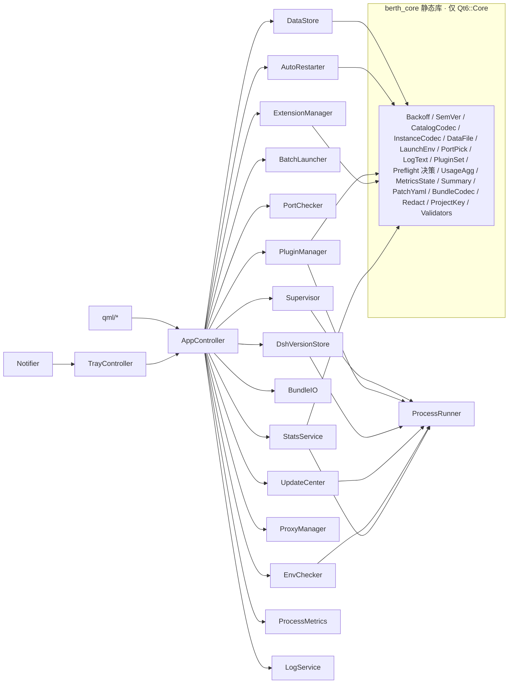

# Design Document：berth-enhancements

## Overview

在不改 dsh 本体的前提下，为 DSH Berth 补齐 27 条需求。技术约束：Qt 6.10.2（Core/Gui/Qml/Quick/QuickControls2/Network/Widgets/WebView）、仅 Windows、单用户。沿用仓库约定：后台子进程统一走 `QProcess` + `CREATE_NO_WINDOW`，由 `AppController` 暴露给 QML，配置用 JSON 存在 `%APPDATA%\dsh-Berth\`。

核心结构调整：把纯逻辑抽到静态库 `berth_core`（只链接 Qt6::Core），主程序 `dsh-berth` 和测试程序 `berth_tests`（Qt6::Test）共用它。凡是涉及 QML、Widgets、Win32、进程或网络的代码都留在主程序里。

### 阶段划分

| 阶段 | 需求 | 完成后可独立使用的内容 | 对后续阶段的临时降级 |
|---|---|---|---|
| 0 数据兼容层与测试骨架 | 25、26（ProcessRunner）、27 | schema 版本、备份、未知字段保留、只读模式；`berth_core` + `berth_tests` 可构建 | — |
| B 稳定性 | 11、12、13 | 崩溃重启、端口冲突/复用、批量与错峰启动 | 11.3 的系统通知先降级为主窗口 notice + 日志（D 阶段接入 Notifier）；13 的"启动分组"在需求 9 落地前隐藏 |
| D 托盘与体验 | 17、18、19、20 | 托盘泊位菜单、自启、关闭到托盘、通知、日志页 | 17.7 的泊位图标在需求 9 落地前用默认图标 |
| A 管理 | 1–10 | 插件、市场、自检、重启提示、Launch_Env、多版本、整包、扩展、分组标签、外部编辑器 | — |
| E 统计 | 21–24 | 会话、用量、进程指标、汇总面板 | 24.7 的可用更新数在 C 阶段前隐藏 |
| C 更新与环境 | 14、15、16 | 更新面板、环境检测、代理 | — |

需求 5（Launch_Env）属于 A 阶段，但 Supervisor 的环境与参数组装接口在 B 阶段就按最终签名实现（先传空表），避免 A 阶段再改一次 Supervisor。

### 待定决策

以下两项尚未拍板，记录在同目录 `TODO.md`。本文暂按方案 A 写；对应阶段开始前再定，改选 B 时只动下列段落与相关任务。

| # | 问题 | 暂用方案 A | 备选 B | 所属阶段 |
|---|---|---|---|---|
| 1 | Skills 如何启用/禁用 | 移入/移出 `.berth-disabled/` 子目录 | 只显示不开关 | A 管理（需求 8） |
| 2 | Token 用量如何读取 | 内置 Node 脚本 `usage-scan.mjs` 解析 zstd 日志 | 本期不做，按 22.5 降级 | E 统计（需求 22） |

## 依赖调研结论

| # | 结论 | 依据（`deepseek-harness/` 下路径） |
|---|---|---|
| 1 | 会话日志根目录是 `$DSH_HOME/sessions`，不按 profile 区分。布局为 `<root>/--<projectKey(cwd)>--/<encodedId>/session[.vN].jsonl[.zstd]`，无 cwd 的会话放在 `_no-cwd/`，默认 zstd 压缩。明文投影缓存在 `$DSH_HOME/storages/session_projcache/sessions/<id>.json`（`identity{createdAt,cwd,...}` + `rows{key:{ver,seq,val}}`，`rows.sessionStats.val` 含 turns/steps）。dsh 没有可从外部读取的"活跃会话"标记：写锁在 Windows 上是命名内核信号量，不落盘。 | `packages/bundle/base/cordis.patch.yml`；`packages/session/session-persistence-jsonl/README.zh.md`、`src/format.ts`；`packages/session/session-projection-cache/src/spec.ts`；`packages/session/session-stats/src/types.ts` |
| 2 | 会话日志里有 usage：`assistant/message` 事件的 `data.usage = {inputTokens, outputTokens, cacheReadTokens?}`；模型名在 `request/header` 事件的 `data.header.config.{provider, model}`；事件信封带 `time`（毫秒）。日志默认 zstd 压缩，Qt 读不了。结论：不降级，读取交给 Node 辅助脚本（Node ≥22.15 内置 `zlib.zstdDecompress`）。 | `packages/core/agent-loop/tests/loop.spec.ts`、`tests/request-cache.e2e.ts`；`packages/core/agent/tests/model-selection.spec.ts`；`packages/core/session/src/types.ts` |
| 3 | Skills：skill-filesystem 只扫根目录下一层的 `<name>/SKILL.md` 或 `<name>.md`，frontmatter 没有启用字段。根目录包括 `<projectRoot>/.dsh/skills`、`<projectRoot>/.agents/skills`、`<dshHome>/skills`（跳过 `.system`）、`<agentsHome>/skills`。MCP：每个服务是 profile `cordis.patch.yml`（以及优先级更高的 `$DSH_HOME/cordis.patch.yml`）里 `name: '@deepseek-ai/dsh-mcp-client'` 的一行，`config.serverName`/`transport`/`command`/`url` 描述服务，启用标记是该行的 `disabled`。 | `packages/skill/skill-filesystem/README.zh.md`；`packages/mcp/mcp-client/README.zh.md`；`packages/boot/app-boot/README.zh.md` |
| 4 | 插件启用 = 包名在 `package.json` 的 `dsh.profile.bundles` 有序数组里，依赖在 `dependencies`。`dsh plugin --profile <n> <pnpm args>` 转发给 pnpm，并与运行中 dsh 共用 profile 写锁。Node 要求 `^22.19.0 \|\| >=24.0.0`（范围，不只是最低版本）。 | `apps/cli/README.zh.md`；`packages/boot/app-boot/README.zh.md`；`deepseek-harness/package.json` engines；`src/PluginOps.cpp` |
| 5 | dsh web 没有健康检查接口。特征探测：`GET http://127.0.0.1:<port>/manifest.webmanifest`，返回 JSON 且 `short_name == "DSH"` 或 `name == "DeepSeek Harness"` 即判定为 dsh。 | `apps/web/public/manifest.webmanifest`、`apps/web/index.html` |

调研带来的设计取舍：

- 会话与用量统计按 DSH_HOME 归属。泊位配置了 workspace 时只统计 `projectKey(workspace)` 对应的项目目录（`projectKey` 在 C++ 里按 `format.ts` 逐字符复刻）。同一 DSH_HOME 下不同 profile 的会话无法区分，界面注明口径。
- 活跃会话：该会话目录下日志文件的最后修改时间在 30 分钟内。启发式，UI 写明口径。
- Token 用量（待定 #2）：内置 Node 辅助脚本 `usage-scan.mjs`（放在 qrc，首次使用时释放到 `%APPDATA%\dsh-Berth\helpers\`），用 `Settings.nodeExecutable` 或 PATH 上的 node 运行，只读遍历日志，stdout 输出按（日、项目、模型）聚合的 JSON。

## Architecture



- 源码目录：`src/core/`（berth_core，不 include 任何 Gui/Qml/Widgets/windows.h）、`src/`（主程序）、`tests/`（berth_tests）。
- 线程：长耗时的文件扫描用 `QThreadPool` + `QRunnable`（或 `QThread::create`），结果用 `QMetaObject::invokeMethod(..., Qt::QueuedConnection)` 回主线程。不用 QtConcurrent（不在允许的模块列表里）。网络统一用一个共享的 `QNetworkAccessManager`，全异步。
- 所有后台子进程经过 `ProcessRunner`：`CREATE_NO_WINDOW`、独立 Job Object（`KILL_ON_JOB_CLOSE`）、超时、保留输出尾部 N 行、注入代理/镜像环境变量。Berth 退出时析构关闭 Job 句柄，满足 26.8。泊位 dsh 进程仍由 Supervisor 自己的 Job 管理。

### 现有类的改动

| 类 | 改动 |
|---|---|
| `Instance` | 新增字段见 Data Models；加 `QJsonObject extra` 保存无法识别的字段 |
| `Settings` | 新增字段；load/save 改走 `DataFile`（保留未知字段、schema、只读模式） |
| `AppController::load/save` | 改走 `DataStore`；`instances.json` 从顶层数组（schema 0）升级为对象（schema 1） |
| `Supervisor` | `start(const LaunchSpec&)` 取代 `start(Instance, exe)`；区分"请求停止"和"非请求退出"，后者发 `crashed(id, exitCode)`；新增 `attachExternal(id, pid, port)`；暴露 `jobHandle(id)` 供指标采集；`finished` 不再按 exit 0 判定 stopped |
| `PluginOps` | 新增 `setEnabled`，`readPlugins` 返回隔离标记；纯逻辑移到 `core/PluginSet` |
| `DshUpdate` | 保留，由 UpdateCenter 调用它处理 System_Dsh 的升级 |
| `main.cpp` | 托盘逻辑移到 `TrayController`；解析 `--autostart` |

## Components and Interfaces

### berth_core（纯逻辑，可测）

| 组件 | 职责 | 关键接口 |
|---|---|---|
| `Backoff` | 退避间隔 | `int backoffMs(int n, int baseSec, int maxSec)` |
| `RestartState` | 自动重启状态机（值类型） | `Action onCrash(); void onRunningFor(int sec); void onManualStop(); void onManualStart(); void onToggle(bool)`；字段 `n, N`；`Action{None, Schedule(ms), GiveUp}` |
| `SemVer` | 解析、比较、npm 范围匹配 | `std::optional<SemVer> parse(QString)`（忽略开头 v/V）；`int compare(a,b)`；`bool satisfies(SemVer, QString range)`（支持 `^ ~ >= <= > < = x * \|\|` 与连字符范围） |
| `CatalogCodec` | 插件目录解析与打印 | `Result<QList<CatalogEntry>> parse(QByteArray)`；`QByteArray print(QList<CatalogEntry>)`；`filter(list, keyword)` |
| `Validators` | npm 包名、git URL、目录源 URL、env 键、标签/分组/备注、端口、代理字段、单价 | 每个函数返回 `std::optional<QString> error` |
| `LaunchEnv` | 环境变量与参数组装 | `QProcessEnvironment build(sys, envTable, dshHome, proxyEnv, inheritProxy)`；`QStringList filterArgs(extra, QStringList *conflicts)` |
| `InstanceCodec` | Instance 与 JSON 互转，保留未知字段 | `Instance fromJson(QJsonObject, QStringList *typeErrors)`；`QJsonObject toJson(const Instance&)` |
| `DataFile` | schema 决策、备份文件名、读后写回 | `LoadResult load(QByteArray, int supported)` → `{mode: Normal/ReadOnly/Corrupt, version, root}`；`QString backupName(file, oldVer)` |
| `PortPick` | 挑选空闲端口 | `std::optional<int> next(int from, isListening, configuredPorts)` |
| `PluginSet` | bundles 启用/禁用、列表过滤、批量汇总 | `QJsonObject setEnabled(QJsonObject pkg, name, bool)`；`list(pkg, showCore, quarantined)` |
| `PreflightDecision` | 根据检查结果决定隔离哪些插件 | `Decision decide(QList<CheckResult> before, optional<QList<CheckResult>> after, RepairOutcome)` |
| `AffectedSet` | 受影响泊位判定与去重合并 | `QStringList affected(instances, home, profile)`；`merge(list, more)` |
| `PatchYaml` | cordis.patch.yml 行级读取与改写（只处理 `id`/`name`/`disabled` 与 mcp-client 的 `config` 摘要） | `Result<QList<PatchRow>> parse(QString)`；`QString setDisabled(QString text, rowId, bool)` |
| `BundleCodec` | Bundle 清单与文件表 | `QByteArray encode(Bundle)`；`Result<Bundle> decode(QByteArray, int maxFormat)`；`bool excluded(relPath)` |
| `LogText` | 行级别判定、搜索、尾部切分、大小格式化 | `Level classify(QStringView)`；`QList<Match> find(text, kw)`；`qsizetype firstLineStart(QByteArray chunk)`；`QString humanSize(qint64)` |
| `UsageAgg` | 用量汇总、按天归入区间、费用计算 | `Totals aggregate(records, range, tz)`；`std::optional<double> cost(Totals, Price)` |
| `MetricsState` | 进程计数累加、CPU 百分比换算 | `onStart(); onExit(code, crash, at); addRuntime(sec); reset()`；`double cpuPercent(d100ns, dWallMs, cores)` |
| `Summary` | 汇总面板计算 | `Summary compute(statuses, samples)`；`QString formatMem(double mb)` |
| `ProjectKey` | 复刻 dsh 的 `projectKey(cwd)` | `QString projectKey(QString cwd)` |
| `Redact` | 诊断报告与日志脱敏 | `QString redact(QString text, QStringList secrets)`；`QString redactProxyUrl(QString)` |
| `TrayRules` | 状态对应的菜单可用性 | `MenuFlags flagsFor(Status)` |
| `BatchPlan` | 错峰调度计划 | `QList<Step> plan(targets, statuses, intervalSec)` |

### 主程序（Qt/Win32/进程/网络）

| 组件 | 职责 | 关键接口（Q_INVOKABLE 或信号） |
|---|---|---|
| `DataStore` | 读写 settings/instances/metrics/quarantine，负责备份与只读模式 | `bool readOnly(file)`；`bool save(file, QJsonObject)`；`signal loadWarnings(QStringList)` |
| `ProcessRunner` | 统一的后台子进程执行 | `run(program, args, {env, cwd, timeoutMs, tailLines}) → signal finished(ok, code, tail, timedOut)` |
| `AutoRestarter` | 持有每个泊位的 `RestartState`，用 QTimer 执行退避与 120 秒清零 | `signal countdown(id, sec, n, N)`；`cancel(id)` |
| `PortChecker` | 端口监听检查、查占用进程、dsh 特征探测、监视外部进程 | `Occupant check(port)`；`probeDsh(port) → signal`；`watchExternal(id,pid,port)` |
| `BatchLauncher` | 执行 BatchPlan；取消；汇总 | `startAll/stopAll/startSelected(ids)/…`；`cancel()`；`signal progress(done,total)`、`finished(summary)` |
| `Preflight` | 工作线程检查 node_modules，必要时调 `dsh plugin --profile p install` 修复（每 profile 一个串行队列，超时 300 秒） | `run(instanceId) → signal done(Decision / Abort)` |
| `PluginManager` | 列表、启用开关、批量、安装、卸载、隔离、目录市场 | `setEnabled(home,p,name,on)`；`batch(op, names)`；`install(home,p,spec,channel)`；`fetchCatalog()`；`unquarantine(...)` |
| `RestartHintController` | 维护当前 Restart_Hint 列表与"待重启"标记 | `raise(home,p)`；`restartAll()`；`later()`；`Q_PROPERTY pending` |
| `DshVersionStore` | 多版本 dsh 的安装、删除、列表、引用计数 | `install(ver)`；`remove(ver)`；`QString executableFor(ver)` |
| `BundleIO` | 导出与导入 Bundle | `exportInstance(id, path, includeSecrets)`；`importBundle(path, home, resolution)` |
| `ExtensionManager` | Skills 与 MCP 的列表和开关 | `load(home,p,workspace)`；`setSkillEnabled`；`setMcpEnabled` |
| `WorkspaceOpener` | 检测 VS Code / Cursor，打开 workspace | `QVariantMap availability(id)`；`open(id, target)` |
| `UpdateCenter` | 检查 dsh/插件更新、一键升级 | `checkAll()`；`upgrade(itemId)`；`upgradeAll()` |
| `EnvChecker` | 6 项环境检测、winget 安装、导出诊断报告 | `checkAll()`；`install(item)`；`exportReport(path)` |
| `ProxyManager` | 代理设置、自动探测、测试连接、镜像、DPAPI | `detect()`；`test(draft)`；`QNetworkProxy proxy()`；`QHash<QString,QString> childEnv()` |
| `TrayController` | 主托盘菜单、泊位子菜单、泊位独立托盘图标 | 连接 `InstanceModel::dataChanged` 刷新菜单 |
| `Notifier` | 系统通知与主窗口内提示 | `notify(kind, instanceId, title, body)` |
| `AutostartRegistry` | 读写 HKCU Run 启动项 | `bool set(bool on, QString *err)`；`bool isRegistered()` |
| `LogService` | 异步读取日志尾部/分段、清空、截断、导出 | `loadTail(id)`；`loadMore(id)`；`clear(id)`；`exportTo(id,path)` |
| `StatsService` | 会话统计（C++ 扫目录）与用量统计（Node 辅助脚本） | `sessionStats(id)`；`usage(range)` |
| `ProcessMetrics` | 每 2 秒采样，写 metrics.json | `QVariantMap current(id)`；`QVariantList trend(id)`；`reset(id)` |

## Data Models

### `instances.json`（schema 1）

```json
{
  "schemaVersion": 1,
  "instances": [{
    "id": "…", "name": "…", "port": 3080, "profile": "web", "dshHome": "", "workspace": "", "autostart": false,
    "env": [{ "key": "FOO", "value": "bar", "secret": false }],
    "extraArgs": ["--foo", "bar"],
    "dshVersion": "",
    "autoRestart": false,
    "icon": { "kind": "none|builtin|file", "value": "" },
    "group": "", "tags": [], "notes": ""
  }]
}
```

- schema 0 是现在的顶层数组。读取时转成对象；第一次写回前先备份为 `instances.json.bak-0`。
- `dshVersion` 为空表示系统 dsh。`icon.value` 在 `file` 类型下是相对 `%APPDATA%\dsh-Berth\icons\` 的路径。
- 敏感值明文保存（文件在当前用户 APPDATA 下），只在 UI、日志和报告里掩码。
- `status`/`pid`/`lastError`/"待重启"/倒计时都是运行时状态，不写盘。

### `settings.json`（schema 1，只列新增字段）

```json
{
  "schemaVersion": 1,
  "catalogUrl": "https://dsh-plug.in/api/plugins.json",
  "preflightEnabled": true,
  "autoRestart": { "baseSec": 2, "maxSec": 60, "maxAttempts": 5 },
  "staggerSec": 3,
  "updateCheckHours": 24,
  "trayInstanceIcons": false,
  "closeToTray": true,
  "notify": { "crash": true, "ready": true, "update": true },
  "proxy": { "mode": "none|system|manual", "scheme": "http", "host": "", "port": 0, "user": "", "passwordDpapi": "" },
  "npmRegistry": { "kind": "official|preset|custom", "url": "" },
  "mirrorFallback": false,
  "instanceInheritProxy": false,
  "modelPrices": { "<model>": { "input": 0, "output": 0, "cache": 0 } },
  "pluginChannels": { "<home>|<profile>|<name>": "stable" }
}
```

"开机自启 Berth"不写进 settings.json，以注册表实际状态为准（18.10）。

### 其他文件（都在 `%APPDATA%\dsh-Berth\`）

| 文件/目录 | 内容 |
|---|---|
| `metrics.json` | `{schemaVersion:1, instances:{<id>:{runtimeSec, starts, crashes, lastExitCode, lastExitAt}}}` |
| `quarantine.json` | `{schemaVersion:1, entries:[{home, profile, name, at, reason:"missing\|dep-unresolved\|install-failed\|install-timeout\|no-package-manager", detail}]}`，`home` 规范化（绝对路径、小写比较） |
| `catalog-cache.json` | CatalogCodec::print 的输出 |
| `dsh-versions/<semver>/` | `npm install -g --prefix <dir> @deepseek-ai/dsh@<ver>` 的结果，可执行文件为 `<dir>\dsh.cmd`；安装期间目录名为 `<ver>.partial`，成功后改名 |
| `icons/` | 泊位自定义图标副本 |
| `helpers/usage-scan.mjs` | 从 qrc 释放的 Node 辅助脚本 |
| `berth.log` | Berth 自身日志（通知失败、更新结果） |

### Bundle 文件（`.berthbundle`，单个 JSON，UTF-8）

`{manifest:{formatVersion:1, exportedAt, berthVersion, type:"instance|profile", profileName}, files:[{path, encoding:"utf8|base64", content}], plugins:[{name, version, enabled}], instance?:{port, profile, workspace, dshVersion, env, extraArgs}}`。导出时排除任意层级的 `node_modules/`、`*.log` 与泊位日志。用单个 JSON 而不是 zip，因为 Qt Core 没有 zip 写入 API，也不引入新库。写入用 `QSaveFile`，不留下不完整文件。

### Schema 规则（所有 Berth 数据文件通用）

- 没有 `schemaVersion` 视为 0；高于支持版本进入只读模式，禁止保存；不是合法 JSON 进入 Corrupt 模式，不覆盖原文件，其余数据照常加载并提示。
- 低版本文件第一次写回前，先把原字节复制为 `<file>.bak-<旧版本>`（已存在则不覆盖）；备份失败就放弃写回。
- 写回时把无法识别的顶层字段与泊位字段原样合并回去；字段类型不对时用默认值，并记录"文件名.字段名"，启动完成后提示。

## Win32 API 选择

| 用途 | API | 链接库 |
|---|---|---|
| 进程树 CPU | `QueryInformationJobObject(JobObjectBasicAccountingInformation)`，TotalUserTime+TotalKernelTime 差值 ÷ (墙钟差值 × 逻辑核数) | kernel32 |
| 进程树内存 | `QueryInformationJobObject(JobObjectBasicProcessIdList)` 取 PID，逐个 `K32GetProcessMemoryInfo` 求 WorkingSetSize 之和；外部进程只采单个 PID | kernel32 |
| 端口占用与 PID | `GetExtendedTcpTable(TCP_TABLE_OWNER_PID_LISTENER)`，IPv4/IPv6 都查；进程路径用 `QueryFullProcessImageNameW` | iphlpapi |
| 外部进程存活 | `OpenProcess(SYNCHRONIZE)` + `WaitForSingleObject(0)` | kernel32 |
| 开机自启 | `QSettings("HKEY_CURRENT_USER\\Software\\Microsoft\\Windows\\CurrentVersion\\Run", NativeFormat)`，值名 `DSH Berth`，值 `"<exe>" --autostart` | Qt |
| 系统代理 | 读 `HKCU\Software\Microsoft\Windows\CurrentVersion\Internet Settings` 的 `ProxyEnable`/`ProxyServer` | Qt |
| 代理密码 | `CryptProtectData` / `CryptUnprotectData`（当前用户范围） | crypt32 |
| WebView2 检测 | 注册表 `…\EdgeUpdate\Clients\{F3017226-FE2A-4295-8BDF-00C3A9A7E4C5}` 的 `pv`（HKLM WOW6432Node 与 HKCU 都查） | Qt |
| 系统通知 | `QSystemTrayIcon::showMessage`（Win10/11 显示为 toast），`messageClicked` 捕获点击，Notifier 记住最近一条通知的泊位 id；`supportsMessages()==false` 或托盘不可见时写日志 | Qt Widgets |
| 独立托盘图标 | 每个运行中泊位一个 `QSystemTrayIcon`，退出时逐个 `hide()` 再 delete | Qt Widgets |
| Windows 版本 | `RtlGetVersion`（写进诊断报告） | ntdll（动态获取） |

以上都是 Windows 10 1809 已有的 API。CMake 需显式链接系统库 `iphlpapi`、`crypt32`。

## 关键流程约定

- **崩溃判定**：Supervisor 为每个进程记"请求停止"标志（手动停止、重启、批量停止、退出应用都会设置）。进程退出时标志未设置即为 Crash，不管退出码。自动重启过程中进入"运行中"之前退出也算 Crash（11.8）。
- **启动流水线**（手动、重启、批量、自动重启共用）：`端口检查 → [冲突对话框] → 版本可执行文件解析 → Preflight（开关开启时）→ LaunchEnv 组装 → Supervisor::start`。任何一步拒绝都返回带原因的 `LaunchRejected`，BatchLauncher 与 AutoRestarter 计为失败。
- **参数顺序**：`--profile <p> --port <n> --no-open` + 过滤后的 extraArgs。环境优先级由低到高：系统环境 < 代理环境（instanceInheritProxy 开启时） < 泊位环境变量表 < Berth 注入的 `DSH_HOME`。
- **插件安装**：`dsh plugin --profile <p> add <spec>`（转发给 pnpm），成功后确保包名在 bundles 里；失败时恢复安装前的 `package.json` 快照（2.12）。渠道映射：stable→`latest`，beta→`beta`，alpha→`alpha`（dist-tag）。
- **Preflight 依赖解析**：取插件包在 node_modules 里的真实路径（`QFileInfo::canonicalFilePath`，兼容 pnpm 符号链接），从该目录按 Node 解析规则逐级向上找 `node_modules/<dep>/package.json`，用 `SemVer::satisfies` 校验。只检查 `dependencies`，不查 peer/optional。
- **Skills 启用/禁用**（待定 #1，暂用 A）：禁用 = 把 `<root>/<name>/` 或 `<root>/<name>.md` 移到 `<root>/.berth-disabled/`；skill-filesystem 只扫一层，所以不会被发现；启用即移回。只管理 `<dshHome>/skills` 与泊位 workspace 的 `.dsh/skills`、`.agents/skills`。
- **MCP 启用/禁用**：只改目标行的 `disabled:`（没有该键则插入 `disabled: true`，启用时删掉该键，保证往返文本一致）。遇到 `disabled: !!js …`、flow 风格或锚点时该条目只读并说明原因。写入前比较 mtime、大小与 SHA-256，发现外部修改就放弃写入。
- **会话统计**：工作线程枚举 `sessions/<项目目录>/*/`，会话数 = 会话目录数，最近活动 = 日志文件最大 mtime。只读打开、不加锁。
- **用量统计**（待定 #2，暂用 A）：`node usage-scan.mjs --root <home>/sessions [--project <key>] --since <ms>`，stdout 输出 `[{day, project, model, input, output, cache}]`。脚本只读打开文件、`zlib.zstdDecompressSync` 解压、逐行解析 JSON、跳过坏行。所有泊位都没有 usage 记录时按 22.5 隐藏用量区域。

## Error Handling

- 一律异步，结果带原因：长耗时操作通过 `finished(ok, message)` 类信号返回，UI 在发起位置显示错误，不弹模态框（统计类在 tooltip 显示原因）。
- 先快照再写，失败回滚：写 `package.json`、`cordis.patch.yml` 前读原字节，写入统一用 `QSaveFile`；包管理器失败时写回快照。批量操作按项回滚。
- 数据文件不毁坏：Corrupt 或只读模式禁止保存；备份失败放弃写回。
- 外部命令失败：`ProcessRunner` 保留最后 20 行输出作为摘要；超时结束整个 Job 并标记"超时"。
- 可执行文件缺失（pnpm、node、winget、code、cursor）：调用前用 `QStandardPaths::findExecutable` 或已知路径判断，直接给出"缺失"原因。
- 网络：15 秒（目录）/30 秒（registry）超时后 `abort()`，失败时显示缓存或上一次结果。
- 脱敏：Berth 标记行、诊断报告写出前都经过 `Redact`。
- 单点失败不扩散：采样、统计读取失败只影响对应显示项，不改变泊位状态。

## Testing Strategy

- **目标结构**：`CMakeLists.txt` 新增 `option(BERTH_BUILD_TESTS ON)`；`berth_core`（STATIC，只链接 Qt6::Core）；`berth_tests`（链接 berth_core + Qt6::Test，不链接 Widgets/Qml，`add_test` 注册）。`tests/` 下每个领域一个 `QObject` 测试类（`tst_backoff.cpp`、`tst_semver.cpp`、`tst_catalog.cpp`、`tst_datafile.cpp`、`tst_launchenv.cpp`、`tst_pluginset.cpp`、`tst_patchyaml.cpp`、`tst_bundle.cpp`、`tst_logtext.cpp`、`tst_usage.cpp`、`tst_metrics.cpp`、`tst_summary.cpp`、`tst_misc.cpp`），一个 `main` 依次执行。
- **性质测试**：不用第三方 PBT 库。`tests/gen/Gen.h` 提供基于 `QRandomGenerator` 的生成器（版本号、npm 包名、env 表、参数列表、package.json、目录条目、Instance、日志文本、usage 记录、事件序列），种子固定 `20260101`，可用环境变量 `BERTH_PBT_SEED` 覆盖。`forAll<T>(100, gen, prop)` 失败时 `QFAIL` 输出种子、迭代序号与反例 JSON。每条性质至少 100 次迭代。
- **标注**：每个性质测试函数前写 `// Feature: berth-enhancements, Property N: <标题>`，一条性质一个测试函数。
- **单元测试**：只覆盖边界，例如 `projectKey` 对照 dsh `format.ts` 样例、schema 0 数组迁移、`.bak-0` 已存在不覆盖、`disabled: !!js` 只读、Node 23.x 判为不满足、HKCU Run 值解析。
- **不自动化的部分**：QML、托盘、Win32、网络、子进程。每个实施任务附手动验证步骤（前置条件、编号步骤、可观察结果），由用户编译运行。AI 不执行构建、测试，也不启动程序。

## Correctness Properties

*A property is a characteristic or behavior that should hold true across all valid executions of a system-essentially, a formal statement about what the system should do. Properties serve as the bridge between human-readable specifications and machine-verifiable correctness guarantees.*

### Property 1: 退避间隔公式与单调性
For any baseSec∈[1,60]、maxSec∈[baseSec,600] 与 n∈[1,20]，`backoffMs(n)` 等于 `min(2^(n-1)·base, max)·1000`；对任意 N，序列 `backoffMs(1..N)` 单调不减且每项不超过 maxSec·1000。
**Validates: Requirements 11.2, 11.7**

### Property 2: 自动重启状态机
For any 事件序列（crash、运行满 120 秒、手动停止、手动启动、开关切换、外部运行），`RestartState` 始终满足 0 ≤ n ≤ N；仅当开关开启、非外部运行且 n < N 时 crash 产生 `Schedule(backoffMs(n+1))`，n==N 时产生 `GiveUp`；运行满 120 秒、手动停止、手动启动、关闭开关之后 n 为 0。
**Validates: Requirements 11.1, 11.3, 11.4, 11.5, 11.8, 11.9, 11.10**

### Property 3: SemVer 全序与格式规则
For any 两个合法 SemVer 字符串 a、b（随机加 v/V 前缀），`compare(a,b) == -compare(b,a)` 且满足传递性；同号版本中带预发布标签的低于正式版本；任意非法字符串 `parse` 返回空，判定为"版本无法比较"且不标记有更新；已安装版本列表按 compare 降序。
**Validates: Requirements 14.8, 14.9, 6.2**

### Property 4: 版本范围匹配与参考实现一致
For any 合法版本 v 与由 `^ ~ >= <= > < = x || 连字符` 组合生成的范围 r，`satisfies(v, r)` 与测试内按区间展开的参考实现一致；对 `^22.19.0 || >=24.0.0` 的 Node 版本判定同样成立。
**Validates: Requirements 3.1, 15.2**

### Property 5: 插件目录往返
For any 合法目录条目列表（包名非空、至少一个渠道版本、描述可空），`parse(print(list))` 与 list 等价：条目数、顺序、包名、描述、各渠道版本均相同。
**Validates: Requirements 2.3, 2.5, 2.6**

### Property 6: 非法目录被拒绝并指出字段
For any 合法目录，随机删掉某条目的包名或全部渠道版本（或破坏 JSON 语法）后，`parse` 失败且错误信息包含对应字段名或出错位置。
**Validates: Requirements 2.4**

### Property 7: 市场搜索过滤
For any 条目列表与关键字 k，过滤结果正好是包名或描述包含 k（不区分大小写）的条目，保持原顺序；k 为空时返回全部。
**Validates: Requirements 2.7**

### Property 8: 输入格式校验
For any 生成的合法 npm 包名（可带 scope 与 `@版本`/`@tag` 后缀）或合法 git URL，校验通过；随机破坏（加大写、加空格、以 `.`/`_` 开头、长度超过 214）后校验失败；目录源 URL 当且仅当以 `http://` 或 `https://` 开头时被接受。
**Validates: Requirements 2.2, 2.11**

### Property 9: 启用开关只影响目标插件且可往返
For any package.json 对象与其中的插件 p，`setEnabled(pkg, p, x)` 只改变 p 是否在 bundles 中，`dependencies`、其他插件启用状态与其他字段不变；`setEnabled(setEnabled(pkg,p,false),p,true)` 与 pkg 的各插件启用状态完全相同。
**Validates: Requirements 1.2, 1.9**

### Property 10: 插件列表内容与核心包过滤
For any package.json，`list(pkg, showCore=false)` 对每个非 `@deepseek-ai/*` 插件恰好返回一行，enabled 等于其是否在 bundles 中，版本为空时显示"—"；showCore=true 的结果等于 showCore=false 的结果加上全部核心包。
**Validates: Requirements 1.1, 1.5**

### Property 11: 批量汇总
For any 选中列表与逐项成功/失败结果序列，成功数 + 失败数 = 选中数，失败项启用状态与操作前相同；当且仅当成功数 ≥ 1 且受影响泊位非空时恰好触发一次 Restart_Hint。
**Validates: Requirements 1.6, 1.7, 1.8**

### Property 12: 自检隔离决策
For any 启用插件集合与修复前、修复后的检查结果（修复可能失败或缺少包管理器），被隔离集合正好是最终仍未通过的插件，剩余启用集合正好是通过的插件，两者不相交且并集等于原启用集合；每个被隔离插件的原因属于约定枚举。
**Validates: Requirements 3.4, 3.5, 3.9**

### Property 13: 受影响泊位判定与合并
For any 泊位集合与目标 (home, profile)，`affected` 返回的正好是规范化 home 相同（不区分大小写）、profile 相同、状态为"启动中"或"运行中"的泊位，保持列表顺序；`merge(a, b)` 无重复，a 的顺序不变，b 的新项追加在后。
**Validates: Requirements 4.1, 4.6, 8.4**

### Property 14: 环境变量键校验
For any 环境变量表，校验通过当且仅当每个键非空、不含 `=` 与空白、长度 ≤ 256，且不区分大小写无重复；失败时返回的行号集合正好是违规行。
**Validates: Requirements 5.6, 5.7**

### Property 15: 启动环境组装
For any 系统环境、泊位环境变量表、代理环境与 inheritProxy 开关，`build` 结果满足：表中每项（键不区分大小写）的值等于表中值（含空字符串）；`DSH_HOME` 等于 Berth 计算值；inheritProxy 关闭时不注入代理变量，开启时只有表中没有的代理键才取代理值；系统环境其他键不变。
**Validates: Requirements 5.2, 5.4, 16.3, 16.8**

### Property 16: 启动参数过滤
For any 额外参数列表，`filterArgs` 输出不含 `--port`、`--profile` 及以 `--port=`、`--profile=` 开头的项；单独出现的 `--port`/`--profile` 后紧跟的一项也被移除；其余项相对顺序不变且原样保留；conflicts 正好列出被移除的冲突项。
**Validates: Requirements 5.3, 5.8**

### Property 17: 泊位与设置数据往返（含未知字段）
For any 合法 Instance 列表（含 env、extraArgs、dshVersion、icon、group、tags、notes 与随机未知字段）和合法 Settings 对象，`fromJson(toJson(x))` 与 x 等价：字段集合、值、泊位数量与顺序相同；缺少新增字段的旧对象读取后得到默认值，已有字段不变。
**Validates: Requirements 5.9, 5.10, 9.8, 25.1, 25.3, 25.9**

### Property 18: Schema 决策
For any 文件内容与支持版本 S：版本 > S 为只读模式；非法 JSON 或顶层结构不对为 Corrupt 模式且不产生写入计划；版本 < S 时写回计划第一步为创建 `<file>.bak-<v>`，同名备份已存在时不覆盖；字段类型不对时该字段取默认值并报告文件名与字段名。
**Validates: Requirements 25.2, 25.4, 25.5, 25.6, 25.8**

### Property 19: 脱敏
For any 文本与一组敏感值（env 敏感值、代理用户名/密码、token），`redact` 的输出不包含任何原始敏感值（长度 ≥1），只保留键名；掩码字符串不包含原值中的任何字符。
**Validates: Requirements 5.11, 15.6, 16.7**

### Property 20: 端口选择与重复校验
For any 起始端口 p、监听端口集合 L 与已配置端口集合 C，`next(p)` 返回 (p, 65535] 中最小的既不在 L 也不在 C 的端口，不存在时返回空；保存泊位时当且仅当端口与另一泊位相同才拒绝，并列出所有使用该端口的泊位。
**Validates: Requirements 12.7, 12.8, 12.9**

### Property 21: 批量错峰计划
For any 目标列表、各泊位状态与间隔 t∈[0,60]，`BatchPlan` 跳过处于 Active_State 的泊位（直接计入已完成）；其余泊位按列表顺序在第 k·t 秒发起（k 从 0 连续编号，被跳过的不占序号）；任意时刻取消后，未发起的泊位都不发起并列入汇总。
**Validates: Requirements 13.3, 13.4, 13.8**

### Property 22: 托盘菜单可用性
For any 泊位状态，`flagsFor` 满足：启动可用 ⇔ 不处于 Active_State 且不是"运行中（外部）"；停止可用 ⇔ 启动中、运行中或运行中（外部）；重启可用 ⇔ 运行中；两个打开项可用 ⇔ 运行中或运行中（外部）；停止中时五项全不可用。
**Validates: Requirements 17.2**

### Property 23: 分组、标签与搜索
For any 泊位集合与关键字 k，分组结果中每个泊位只出现一次，分组名为空或全空白的泊位都在"未分组"；搜索结果正好是名称或某个标签包含 trim(k)（不区分大小写）的泊位，空分组被隐藏；超过长度上限、空标签或重复标签（不区分大小写）的输入被拒绝。
**Validates: Requirements 9.1, 9.4, 9.5, 9.6**

### Property 24: 日志行级别与过滤
For any 日志文本，一行被判为错误 ⇔ 包含 `error|ERR|Error|fatal|panic|Unhandled` 之一（区分大小写）；被判为警告 ⇔ 不是错误行且包含 `warn`（不区分大小写）；"仅显示匹配行"与级别过滤同时开启时结果为两者交集。
**Validates: Requirements 20.4, 20.5**

### Property 25: 日志搜索计数与循环跳转
For any 文本与长度 1–256 的关键字，`find` 返回的匹配数等于不区分大小写、不重叠的出现次数，每个匹配位置都对应关键字；从任意序号向前或向后跳转 total 次回到原序号。
**Validates: Requirements 20.1, 20.2, 20.3**

### Property 26: 日志尾部分段加载
For any 文件字节序列与 64KB 分段，首次加载内容从末尾 64KB 中第一个完整行开始；每次"加载更多"拼在前面后，结果仍是原文件的后缀且从行首开始；加载到文件开头后拼接结果等于整个文件。
**Validates: Requirements 20.13**

### Property 27: 文件大小格式
For any 非负字节数 b，`humanSize(b)` 在 b < 1024 时为 `<b> B`，否则按 1024 进位换算为 KB 或 MB 并保留 1 位小数，反解析后与 b 的误差小于所用单位的 0.05。
**Validates: Requirements 20.12**

### Property 28: 会话统计不变量
For any 会话目录集合及其 mtime，会话总数等于目录数，0 ≤ 活跃数 ≤ 总数，最近活动时间等于所有 mtime 的最大值（总数为 0 时为空）；`projectKey` 对任意 cwd 只输出 `[A-Za-z0-9._~-]` 字符，以 `--` 开头和结尾，长度不超过 255。
**Validates: Requirements 21.1, 21.2**

### Property 29: 用量汇总不变量
For any usage 记录集合（模型名与 token 字段可能缺失）与时间范围，按自然日、按泊位、按模型分别汇总后，输入、输出、缓存三项之和都分别等于该范围总量；缺失模型名归入"未知模型"，缺失 token 按 0 计；每条记录按本地日期只归入一个区间。
**Validates: Requirements 22.1, 22.2, 22.4**

### Property 30: 费用计算与单价校验
For any token 汇总与单价，费用等于 token ÷ 1,000,000 × 单价并保留 4 位小数；未配置单价的模型不计入合计并设置"存在未计价模型"标记；单价被接受 ⇔ 在 [0, 10000] 内且最多 4 位小数。
**Validates: Requirements 22.3, 22.9**

### Property 31: 进程指标不变量
For any 由 start、正常退出、崩溃退出、运行时长累加、重置、序列化/反序列化组成的事件序列，任意时刻崩溃次数 ≤ 启动次数、累计运行时长 ≥ 0；重置后三项计数为 0 且无最近退出记录；`metrics.json` 往返后与内存值相等。
**Validates: Requirements 23.1, 23.2, 23.6, 23.7**

### Property 32: CPU 百分比换算
For any CPU 时间差 d ≥ 0、墙钟差 w > 0 与逻辑核数 c ≥ 1，`cpuPercent` 等于 d/(w·c)·100（保留 1 位小数），且 d ≤ w·c 时结果在 [0,100] 内。
**Validates: Requirements 23.3**

### Property 33: 汇总面板计算
For any 泊位状态集合与采样表，泊位总数、运行中数、失败数都是非负整数且运行中数 + 失败数 ≤ 总数；内存总和与 CPU 总和只累加运行中泊位的最近一次采样（无采样按 0 计）；`formatMem` 小于 1024 MB 输出 MB 整数，否则输出保留 1 位小数的 GB。
**Validates: Requirements 24.1, 24.2, 24.3, 24.9**

### Property 34: MCP patch 行编辑往返
For any 生成的 cordis.patch.yml（含注释、若干 mcp-client 行与其他行），`parse` 得到的 MCP 条目与 mcp-client 行一一对应并按名称升序；对 `setDisabled(t, id, true)` 的结果再应用 `setDisabled(…, id, false)` 得到与 t 逐字节相同的文本；每次编辑只改变目标行。
**Validates: Requirements 8.1, 8.2, 8.5**

### Property 35: Bundle 往返与排除
For any 合法 Bundle（泊位或 profile 类型，含或不含敏感值），`decode(encode(b))` 与 b 等价（导出时间与 Berth 版本除外）；导出文件表里没有路径含 `node_modules` 段或以 `.log` 结尾；formatVersion 高于支持版本、缺少清单或插件清单的输入被拒绝。
**Validates: Requirements 7.1, 7.3, 7.8, 7.11**

### Property 36: 代理字段校验
For any 手动代理设置，保存被接受 ⇔ 主机非空且端口为 1–65535 的整数；被拒绝时已保存设置不变。
**Validates: Requirements 16.1, 16.9**
