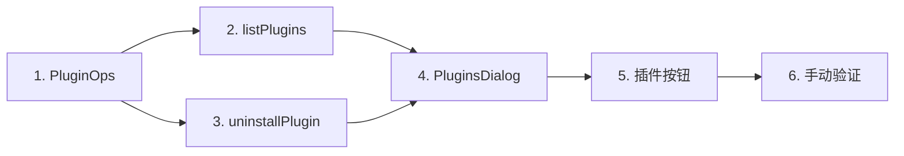

# Implementation Plan

> [!note] Spec 模式：tiny（尺度约定见 requirements.md 开头）

## Overview

按"纯逻辑 → 控制器 → 界面 → 入口 → 手动验证"的顺序实现插件查看与卸载。

## Tasks

- [x] 1. 新增 `src/PluginOps.h/.cpp`，实现 `readPlugins` 与 `removeFromBundles`，并加入 `CMakeLists.txt`
  - `readPlugins` 合并 `dependencies` 与 `dsh.profile.bundles`，过滤 6 个自带 bundle，文件缺失或解析失败时返回 `ok=false` 和原因
  - `removeFromBundles` 只改 `dsh.profile.bundles`，写失败返回错误
  - _Requirements: 1.1, 1.3, 2.3_

- [x] 2. 在 `src/AppController.h/.cpp` 加 `listPlugins(id)`，把 profile 目录解析为 `resolveHome(dshHome)/profiles/<profile>`
  - _Requirements: 1.1, 1.3, 1.4_

- [x] 3. 在 `src/AppController.h/.cpp` 加 `uninstallPlugin(id, name, removePackage)`、`pluginBusy` 属性和 `pluginUninstallFinished` 信号，照 design 的 6 步流程执行
  - 相关泊位运行检查、pnpm 存在检查、先改 bundles，再用 QProcess 异步执行 `dsh plugin --profile <p> remove <name>`（注入 `DSH_HOME`，`CREATE_NO_WINDOW`，合并输出取末尾约 20 行）
  - 任一步失败即停，不回滚
  - _Requirements: 2.3, 2.4, 2.6, 2.7, 3.1, 3.2, 3.3, 4.1, 4.2_

- [x] 4. 新增 `qml/PluginsDialog.qml`，并加入 `CMakeLists.txt` 的 `QML_FILES`
  - 列表（名称、版本、已加载/未加载、卸载按钮）、刷新按钮、空列表与读取失败提示
  - 卸载二级确认：写明插件名和 profile，带"同时卸载插件包"勾选框（默认不勾）
  - `pluginBusy` 时禁用卸载按钮；收到 `pluginUninstallFinished` 后刷新列表并显示 message
  - _Requirements: 1.1, 1.2, 1.3, 1.4, 2.1, 2.2, 2.5, 2.7, 3.2_

- [x] 5. 在 `qml/InstancePane.qml` 操作按钮行"日志"后加"插件"按钮，打开 PluginsDialog 并传入 `pane.selectedId`
  - _Requirements: 1.1_

- [~] 6. 手动验证（由用户编译运行）
  - 选中 `web` 泊位打开插件对话框，确认只列出 `dsh-opencode-session`、不含 `@deepseek-ai/dsh-*`
  - 泊位运行中点卸载，确认被拒绝并提示先停止
  - 停止后不勾选卸载：`package.json` 的 bundles 去掉该项、`dependencies` 仍在，列表显示"未加载"
  - 再勾选卸载：`dependencies` 与 `node_modules` 中该包消失，结果显示 pnpm 输出摘要
  - 临时把 pnpm 移出 PATH 后勾选卸载，确认提示需要安装 pnpm 且文件未改动
  - _Requirements: 1.1, 2.3, 2.4, 3.2, 3.3, 4.1_

## Task Dependency Graph



```json
{
  "waves": [
    { "id": 0, "tasks": ["1"] },
    { "id": 1, "tasks": ["2", "3"] },
    { "id": 2, "tasks": ["4"] },
    { "id": 3, "tasks": ["5"] },
    { "id": 4, "tasks": ["6"] }
  ]
}
```

## Notes

- 编译与运行由用户完成，AI 不自行构建或测试。
- 不加自动化测试任务。
